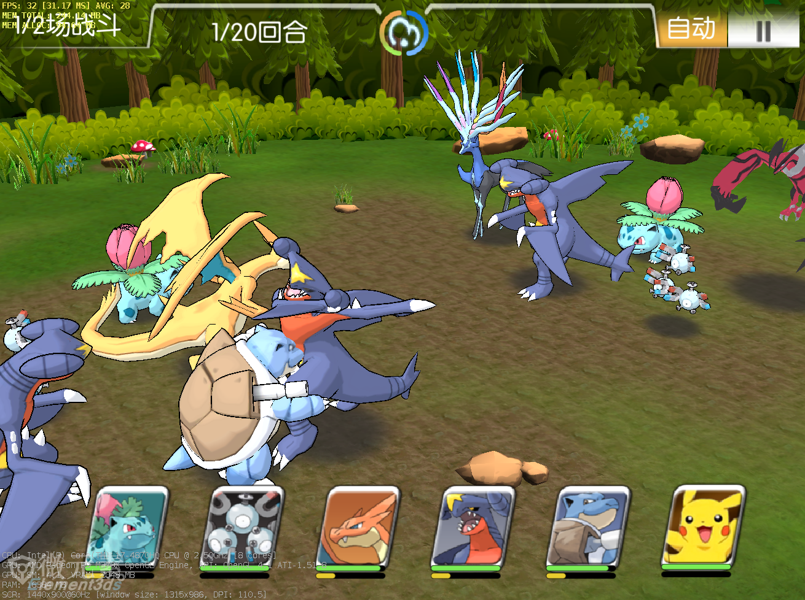
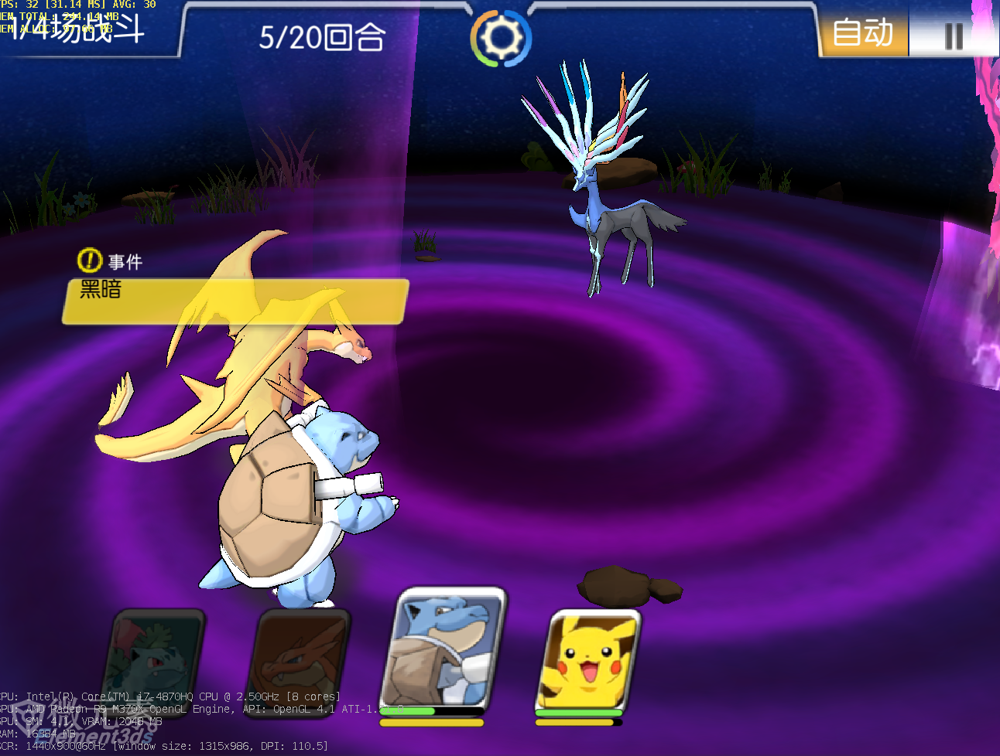

# RoundRpg
一款基于Unity3d，使用Tolua的回合制完整RPG Demo
| 游戏 | 截图 | 截图 | 截图 | 截图 |截图 |
| - | - | --- | --- | - |- |
||

| 分类 | 方案 | 细节 |
| --- | - | --- |
| 客户端 | - | --- |
|  | 框架 | Tolua、战斗等 |
|  | Unity3d | 5.4.4p3版本 |
|  | Tolua | 2.6版本 |
|  | Python2.x | xlrd-0.9.3.tar插件 |
